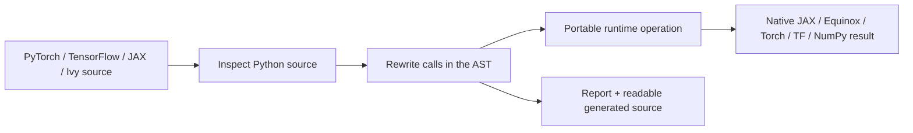

# Hesperus Ivy

<span class="status-chip">2.0.0a1 · active alpha</span>

<p class="hero-copy">
Hesperus Ivy is an Equinox-first portability layer for machine-learning code.
It converts file-defined Python functions and simple modules between PyTorch,
TensorFlow, JAX/Equinox, Ivy, and NumPy while keeping generated code readable,
state explicit, and failures inspectable.
</p>

The implementation is pure Python and ships in the repository. There is no
private compiler download, no hidden source-framework execution after a
successful conversion, and no Flax or Haiku dependency in the JAX module path.

!!! tip "The shortest path"
    Install the `jax` extra, convert a small file-defined function to
    `target="equinox"`, inspect its report, and only then enable JIT compilation.

<div class="grid cards" markdown>

-   :material-download: **Install**

    ---

    Create a Python 3.12 or 3.13 environment with a CPU or NVIDIA dependency
    profile.

    [Installation guide :material-arrow-right:](install.md)

-   :material-swap-horizontal: **Convert code**

    ---

    Lower a framework-shaped callable to a native target and inspect what was
    converted.

    [Five-minute quickstart :material-arrow-right:](tutorials/quickstart.md)

-   :material-alpha-e-box: **Use Equinox**

    ---

    Move modules to JAX PyTrees with explicit state, typed PRNG keys, gradients,
    and native leaf serialization.

    [Equinox tutorial :material-arrow-right:](tutorials/equinox.md)

-   :material-source-branch: **Understand internals**

    ---

    Follow source inspection, AST lowering, target dispatch, reports, and cache
    writes end to end.

    [Internal tutorial :material-arrow-right:](tutorials/internals.md)

</div>

## What it does



Hesperus Ivy rewrites supported framework calls such as `torch.matmul`,
`tf.nn.relu`, and `jax.numpy.reshape` into a small target-aware runtime. The
runtime imports only the selected target and returns that target's array type.
The [primitive catalog](reference/primitives.md) is the exact public lowering
contract.

## Choose a workflow

| Goal | Recommended path | Read next |
| --- | --- | --- |
| Evaluate portability quickly | Function → NumPy, compare outputs | [Quickstart](tutorials/quickstart.md) |
| Move training code to JAX | Function/module → Equinox, then Optax | [PyTorch to Equinox](tutorials/pytorch-to-equinox.md) |
| Keep an Ivy-style application | Select a backend with `ivy.set_backend` | [Core library](reference/library.md) |
| Ship generated Python | Use `emit=`, pin dependencies and commit | [Production deployment](guide/deployment.md) |
| Add framework coverage | Registry + runtime + differential tests + docs | [Add a lowering](internals/extending.md) |
| Diagnose a failed conversion | Save report, generated source, and doctor JSON | [Troubleshooting](guide/troubleshooting.md) |

## Stable contract

The stable source-to-source matrix covers the documented tensor,
neural-network, random, and module/state core. Native target autodiff,
control-flow, optimizer, and serialization APIs remain available around the
converted callable when that target supports them. The compatibility page is
generated from the primitive registry and states where a lowering is native,
composite, or intentionally unavailable.

Distributed runtimes, data pipelines, custom native kernels, dynamic code
without inspectable source, and framework-internal symbols are outside the
stable contract. Hesperus Ivy raises a typed error at those boundaries instead
of silently invoking the source framework. Read [source
requirements](guide/source-requirements.md) before converting generated,
interactive, or decorated callables.

## Install in one command

```bash
uv venv --python 3.13
source .venv/bin/activate
uv pip install --torch-backend=cu130 \
  "hesperus-ivy[nvidia] @ git+https://github.com/Hesperus-Labs/Ivy.git@main"
```

Use `--torch-backend=cpu` and the `all-cpu` extra for a CPU/reference setup.
Run `ivy doctor` to see exactly which optional frameworks and devices are
visible. The [full installation guide](install.md) also covers CPU-only,
JAX-only, editable, and pinned Git installs.

## Documentation promise

These pages describe the current Hesperus fork and are built from
`docs-site/docs/` with strict link and navigation checks. The retained upstream
RST tree is historical reference material only. Each maintained API section
states its supported behavior, limitations, relevant tests, and links to the
current official framework documentation.
