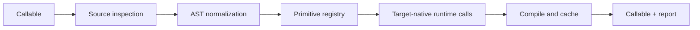

# Internals: the conversion pipeline

The public API is intentionally small, but a conversion has explicit stages:

## Source inspection

`inspect.getsource` reads a file-defined function. Framework imports are
removed from generated source and qualified calls are normalized to a portable
operation name. Function annotations and source decorators are not copied into
the generated callable because they frequently import source-only symbols.

## Canonical lowering

The AST lowerer recognizes framework-qualified calls such as
`torch.matmul`, `tf.nn.relu`, `jax.numpy.reshape`, and `ivy.mean`. It also
normalizes common tensor methods such as `view`, `permute`, `flatten`, and
`unsqueeze`. The runtime then imports only the requested target and calls its
native array operations.

This keeps the output target-native while centralizing the small set of
signature differences between frameworks. A new lowering belongs in the
registry and runtime together, with a differential test.

## Cache lifecycle

Generated source and a JSON manifest live under the platform user cache (or
`HESPERUS_IVY_CACHE_DIR`). Writes use a lock and atomic replacement. The cache
never unpickles model objects. `emit=` copies a readable source/manifest pair to
an application-controlled directory.

## Explicit state

Equinox state is a value returned by the caller’s function, not a hidden module
global. This makes `jax.jit`, `eqx.filter_grad`, and checkpointing composable.
If a source framework mutates an input in a way that cannot be represented as a
JAX value update, conversion fails with a report explaining the boundary.
